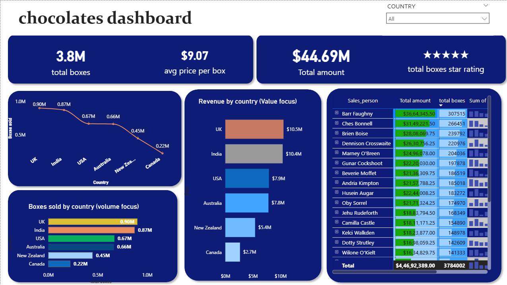
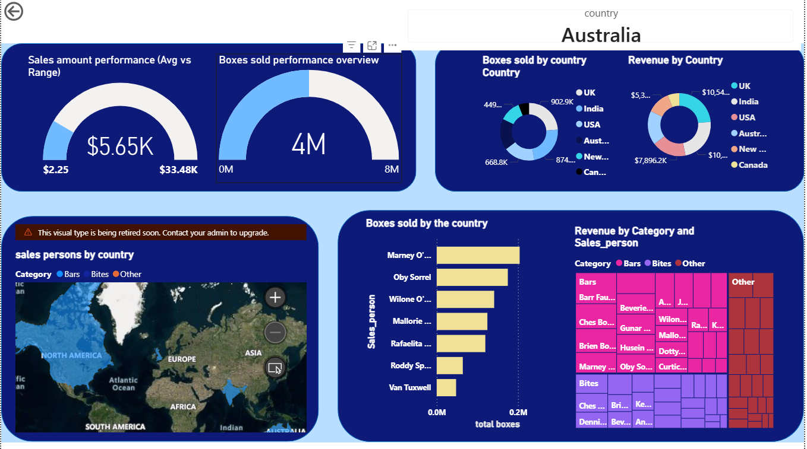

# PowerBI_Chocolate_sales_Dashboard
My first Power BI dashboard
# 📊 Chocolate Sales Dashboard - Power BI

## 📌 Project Overview
This dashboard analyzes chocolate sales performance across regions, categories, and time periods.

## 🎯 Objectives
- Analyze total sales
- Identify top performing regions
- Compare monthly trends
- Track profit margins

## 🛠 Tools Used
- Power BI
- DAX
- Power Query

## 📷 Dashboard Preview

## 📂 Files Included
- Chocolates PowerBI Dashborad.pbix
- sample-chocolate-sales-data-all.xlsx
